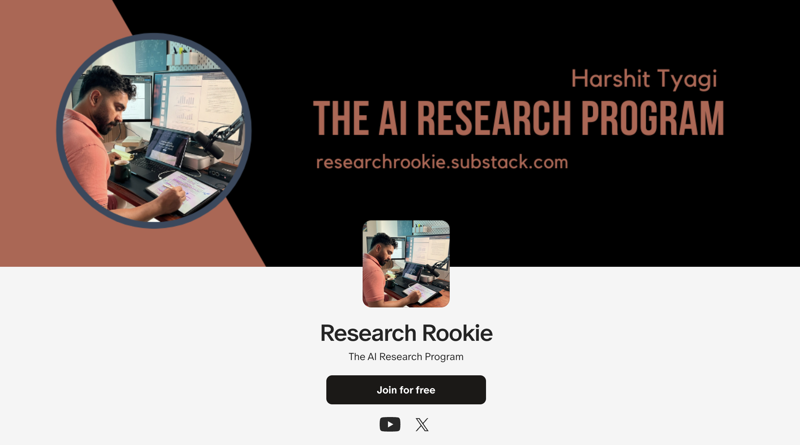

# AI Research Program

An independent AI research program created by [Harshit](https://researchrookie.substack.com/).

I am an educator at ♥️ and I love to deconstruct topics to better understand and teach them. I am now embarking on a journey to re-learn the concepts of AI via this AI Research Program.

I have designed this program to be thorough, exciting, gamified and hands-on. The program also draws inspiration from various Research Engineer roles at companies like [OpenAI](https://openai.com/careers/research-engineer/), [Anthropic](https://boards.greenhouse.io/anthropic/jobs/4019739008), [Meta](https://www.metacareers.com/v2/jobs/2780884748740452/), and the likes.

The following curriculum is designed to help me get a deeper and thorough understanding of all important concepts in AI. 

## Table of contents
- [AI Research Program](#ai-research-program)
  - [Table of contents](#table-of-contents)
  - [My learning approach](#my-learning-approach)
  - [How to consume this?](#how-to-consume-this)
  - [Pillar 1: Foundational Knowledge](#pillar-1-foundational-knowledge)
  - [Pillar 2: Programming and Tools](#pillar-2-programming-and-tools)
  - [Pillar 3: Deep Learning Fundamentals](#pillar-3-deep-learning-fundamentals)
  - [Pillar 4: Reinforcement Learning](#pillar-4-reinforcement-learning)
  - [Pillar 5: NLP / LLM Research](#pillar-5-nlp--llm-research)
  - [Pillar 6: Research Paper Analysis and Replication](#pillar-6-research-paper-analysis-and-replication)
  - [Pillar 7: High-Performance AI Systems and Applications](#pillar-7-high-performance-ai-systems-and-applications)
  - [Pillar 8: Large-scale ETL and Data Engineering](#pillar-8-large-scale-etl-and-data-engineering)
  - [Pillar 9: Ethical AI and Responsible Development](#pillar-9-ethical-ai-and-responsible-development)
  - [Pillar 10: Community Engagement and Networking](#pillar-10-community-engagement-and-networking)
  - [Pillar 11: Research and Publication](#pillar-11-research-and-publication)
  - [Resources](#resources)

## My learning approach
I have a background in Data Science and ML and I've decided to take a recursive approach(going deeper as needed) based on my level of understanding.

My primary purpose of starting this program is to dig deeper into **LLM research and engineering problems**.

So, I'll start from Pillar 5, NLP/LLM research, how LLMs work, how they are pre-trained and how to finetune them. In the process, I will hop onto other Pillars to learn and re-learn a other fundamental concepts.

Keep an eye on [weekly-notes](./weekly-notes) for my learnings and thoughts.

I'll dedicate at least 1 hours daily to my learning.

> ⚠️ This program is still under development and will be updated as I progress in my journey. Feel free to contribute to it by opening issues or suggesting improvements.

## How to consume this?
- Beginners should start with the [Foundational Knowledge](#pillar-1-foundational-knowledge) section.
- For all others who have some exposure to ML/DL, tweak the curriculum as per your level of understanding.
- This curriculum is not supposed to be consumed in a linear fashion. Treat it more like a checklist. 
- You should start with the basics and gradually move towards more complex topics as per your goals and interests.

To follow me in this journey, consider subscribing to my:
- [weekly newsletter](https://researchrookie.substack.com/).
- Learning vlogs at [youtube](https://www.youtube.com/@DataSciencewithHarshit)
- [Discord for discussions and sharing your learnings](https://discord.gg/ux6K7wEu)

## Pillar 1: Foundational Knowledge

| Topic | Subtopics | Learning Resources | Projects/Assignments | Evaluation Criteria |
|-------|-----------|---------------------|----------------------|---------------------|
| Linear Algebra | Vectors, matrices, eigenvalues | MIT OpenCourseWare, 3Blue1Brown videos | Implement basic operations, solve systems of equations | Quiz, problem set, subjective evaluation |
| Calculus | Derivatives, integrals, gradients | Khan Academy, Coursera | Optimization problems, gradient descent implementation | Quiz, problem set, subjective evaluation |
| Probability | Distributions, Bayes theorem | Stanford CS109 | Probabilistic modeling project | Quiz, project review, subjective evaluation |
| Statistics | Hypothesis testing, regression | StatQuest videos, EdX courses | Data analysis project | Project review, subjective evaluation |
| Information Theory | Entropy, mutual information | Elements of Information Theory (book) | Implement compression algorithm | Project review, subjective evaluation |

## Pillar 2: Programming and Tools

| Skill | Subtopics | Learning Resources | Projects/Assignments | Evaluation Criteria |
|-------|-----------|---------------------|----------------------|---------------------|
| Python | Data structures, OOP, functional programming | Python.org tutorials, Real Python | Build a data processing pipeline | Code review, subjective evaluation |
| PyTorch | Tensors, autograd, distributed training | PyTorch documentation, Fast.ai course | Implement and distribute a neural network | Project review, subjective evaluation |
| Git | Version control, branching, merging | Git documentation, GitHub Learning Lab | Contribute to an open-source project | Contribution review, subjective evaluation |
| Linux | Command line, shell scripting, OS internals | Linux Journey, "Operating Systems: Three Easy Pieces" book | Implement a simple process scheduler | Practical test, code review, subjective evaluation |
| Cloud Platforms | AWS, GCP, or Azure basics | Cloud provider documentation | Deploy a scalable web application | Project review, subjective evaluation |
| High Performance Computing | GPU programming, CUDA | NVIDIA CUDA tutorials | Optimize a neural network for GPU computation | Performance benchmarks, subjective evaluation |
| Kubernetes | Container orchestration, scaling | Kubernetes documentation, KodeKloud courses | Deploy and scale an ML model using Kubernetes | Project review, subjective evaluation |

## Pillar 3: Deep Learning Fundamentals

| Topic | Subtopics | Learning Resources | Projects/Assignments | Evaluation Criteria |
|-------|-----------|---------------------|----------------------|---------------------|
| Neural Networks | Perceptrons, activation functions, backpropagation | Deep Learning book by Goodfellow et al. | Implement a multi-layer perceptron | Code review, subjective evaluation |
| CNNs | Convolution, pooling, modern architectures | CS231n course materials | Build an image classification model | Project review, subjective evaluation |
| RNNs | LSTM, GRU, sequence modeling | D2L.ai tutorials | Implement a language model | Code review, subjective evaluation |
| Attention Mechanisms | Self-attention, multi-head attention | "Attention Is All You Need" paper | Implement and optimize a new attention mechanism | Performance analysis, subjective evaluation |
| Transformer Variants | Transformer-XL, Reformer, Performer | Recent papers on arXiv | Compare compute efficiency of two Transformer variants | Comparative analysis, subjective evaluation |
| Optimization Techniques | SGD, Adam, learning rate schedules | Sebastian Ruder's blog | Compare optimizers on a benchmark task | Report review, subjective evaluation |
| Regularization | Dropout, batch normalization, data augmentation | Papers with Code | Implement and compare regularization techniques | Project review, subjective evaluation |

## Pillar 4: Reinforcement Learning

| Topic | Subtopics | Learning Resources | Projects/Assignments | Evaluation Criteria |
|-------|-----------|---------------------|----------------------|---------------------|
| RL Fundamentals | MDP, value functions, policy gradients | Sutton & Barto book, David Silver's course | Implement and solve classic RL problems (e.g., CartPole, Mountain Car) | Algorithm performance, subjective evaluation |
| Deep RL | DQN, A3C, PPO | OpenAI Spinning Up | Implement a deep RL algorithm for a complex environment (e.g., Atari games) | Agent performance, subjective evaluation |
| RL for NLP | RLHF, sequence generation | Recent papers (e.g., InstructGPT) | Fine-tune a language model using RL | Model improvement, subjective evaluation |

## Pillar 5: NLP / LLM Research
| Topic | Subtopics | Learning Resources | Projects / Assignments | Evaluation Criteria |
|-------|-----------|---------------------|------------------------|----------------------|
| 1. Foundations | - Word Vectors/Embeddings - Tokenization - Preprocessing - Data Sampling | - Book: "Speech and Language Processing" by Jurafsky & Martin - Course: Stanford CS224N: NLP with Deep Learning - Paper: "Efficient Estimation of Word Representations in Vector Space" by Mikolov et al. | - Implement word2vec from scratch - Build a custom tokenizer for a specific language or domain - Create a data preprocessing pipeline for a large text corpus | - Accuracy of word embeddings on analogy tasks - Efficiency and coverage of tokenization - Quality and cleanliness of preprocessed data |
| 2. Classical NLP Techniques | - Hidden Markov Models - Naive Bayes - Maximum Entropy Markov Models - Conditional Random Fields | - Book: "Foundations of Statistical Natural Language Processing" by Manning & Schütze - Tutorial: "A Tutorial on Hidden Markov Models and Selected Applications in Speech Recognition" by Rabiner | - Implement a part-of-speech tagger using HMMs - Build a spam classifier using Naive Bayes - Develop a named entity recognition system using CRFs | - Accuracy on standard POS tagging datasets - Precision, recall, and F1 score for spam classification - F1 score on CoNLL 2003 NER dataset |
| 3. Neural Architectures | - Feed-forward Neural Networks - Recurrent Neural Networks - Convolutional Neural Networks - Attention Mechanisms - Transformers | - Book: "Deep Learning" by Goodfellow, Bengio, & Courville - Paper: "Attention Is All You Need" by Vaswani et al. - Course: fast.ai Practical Deep Learning for Coders | - Implement a sentiment analysis model using CNNs - Build a language model using LSTMs - Create a machine translation system using Transformers | - Accuracy on sentiment analysis benchmarks (e.g., IMDb) - Perplexity of language model on test set - BLEU score for machine translation |
| 4. Language Models | - N-gram Models - Neural Language Models - Autoregressive vs. Autoencoder Models - Large Language Models (LLMs) - Vision-Language Models (VLMs) | - Paper: "Language Models are Few-Shot Learners" (GPT-3) - Blog: "The Illustrated Transformer" by Jay Alammar - Course: Hugging Face NLP Course | - Fine-tune GPT-2 for text generation - Implement a BERT-based question answering system - Create a multimodal model for image captioning | - Perplexity and cross-entropy loss - F1 and Exact Match scores for QA - BLEU, METEOR, and CIDEr scores for image captioning |
| 5. Advanced LLM Concepts | - LLM Alignment - Token Sampling Methods - Context Length Extension - Personalization | - Paper: "Constitutional AI: Harmlessness from AI Feedback" by Anthropic - Blog: "How to sample from language models" by Hugging Face - Paper: "LoRA: Low-Rank Adaptation of Large Language Models" | - Implement different decoding strategies (greedy, beam search, top-k, top-p) - Develop a method to extend context length of a pre-trained LLM - Create a personalized language model using adapters | - Human evaluation of model alignment - Quality and diversity of generated text - Perplexity on long-context tasks - Personalization accuracy on user-specific tasks |
| 6. NLP Applications | - Machine Translation - Named Entity Recognition - Textual Entailment - Retrieval Augmented Generation (RAG) - Document Intelligence | - Paper: "Neural Machine Translation by Jointly Learning to Align and Translate" - Tutorial: spaCy's Named Entity Recognition - Paper: "Retrieval-Augmented Generation for Knowledge-Intensive NLP Tasks" | - Build an end-to-end neural machine translation system - Develop a RAG system for question answering - Create a document understanding system for invoice processing | - BLEU, METEOR scores for MT - F1 score for NER - Accuracy on textual entailment datasets (e.g., SNLI) - Relevance and accuracy of RAG responses |
| 7. Knowledge Representation | - Knowledge Graphs - Semantic Networks | - Book: "Knowledge Representation and Reasoning" by Brachman & Levesque - Tutorial: Neo4j Graph Database | - Construct a knowledge graph from a text corpus - Develop a question answering system using a knowledge graph | - Coverage and accuracy of extracted knowledge - Precision and recall of graph-based QA system |
| 8. Challenges and Mitigation | - Hallucination Mitigation - AI Text Detection - Bias Detection and Mitigation | - Paper: "TruthfulQA: Measuring How Models Mimic Human Falsehoods" - Blog: "Detecting Machine-Generated Text" by OpenAI - Paper: "Man is to Computer Programmer as Woman is to Homemaker? Debiasing Word Embeddings" | - Develop a fact-checking system for LLM outputs - Create an AI text detector - Implement bias mitigation techniques in word embeddings | - Reduction in hallucination rate - Accuracy of AI text detection - Reduction in bias measures (e.g., WEAT score) |
| 9. Evaluation and Benchmarking | - LLM/VLM Benchmarks - Task-specific Metrics | - Paper: "GLUE: A Multi-Task Benchmark and Analysis Platform for Natural Language Understanding" - Tutorial: Hugging Face's Evaluate library | - Evaluate an LLM on multiple NLP tasks using GLUE benchmark - Implement and compare different evaluation metrics for a specific NLP task | - Performance across multiple benchmarks - Inter-annotator agreement for human evaluation |
| 10. Practical Aspects | - Large Language Model Ops (LLMOps) - Ethical Considerations | - Book: "Building Machine Learning Pipelines" by Hapke & Nelson - Paper: "On the Dangers of Stochastic Parrots: Can Language Models Be Too Big?" | - Design and implement an LLMOps pipeline - Conduct an ethical audit of an NLP system | - Efficiency and reliability of deployment pipeline - Compliance with ethical AI principles |

## Pillar 6: Research Paper Analysis and Replication

| Activity | Approach | Resources | Deliverables | Evaluation Criteria |
|----------|----------|-----------|--------------|---------------------|
| Paper Reading | Weekly reading of latest papers | arXiv, Papers With Code | Paper summaries, critiques | Quality of analysis, subjective evaluation |
| Research Replication | Reproduce results of significant papers | Original papers, open-source implementations | Replicated experiments, results comparison | Accuracy of replication, subjective evaluation |
| Trend Analysis | Identify and analyze research trends | NeurIPS, ICML, ACL proceedings | Trend reports, blog posts | Insight quality, subjective evaluation |
| Paper Presentation | Present papers to peers or online | Conference recordings | Video explanations, slide decks | Presentation quality, subjective evaluation |
| Extension Projects | Extend or combine ideas from papers | Related work sections of papers | Novel experiments, blog posts | Originality, subjective evaluation |
| Visualization Projects | Develop interactive visualizations for ML concepts | D3.js, Plotly | Create an interactive visualization of attention between tokens in a language model | Visualization quality, insight provided, subjective evaluation |

## Pillar 7: High-Performance AI Systems and Applications

| Topic | Subtopics | Learning Resources | Projects/Assignments | Evaluation Criteria |
|-------|-----------|---------------------|----------------------|---------------------|
| Model Optimization | Quantization, pruning, distillation | TensorFlow Model Optimization Toolkit | Optimize a large model for edge devices | Performance benchmarks, subjective evaluation |
| Efficient Architectures | MobileNet, EfficientNet, BERT-tiny | Papers, GitHub implementations | Implement and benchmark efficient models | Comparative analysis, subjective evaluation |
| Hardware Acceleration | GPU programming, TPU utilization | NVIDIA Deep Learning Institute | Optimize a model for specific hardware | Performance improvement, subjective evaluation |
| Scalable AI Systems | Microservices, containerization, orchestration | Kubernetes documentation, Docker tutorials | Design a scalable AI service architecture | Architecture review, subjective evaluation |
| ML Ops | CI/CD for ML, model monitoring | Google MLOps guides | Set up an MLOps pipeline | Pipeline effectiveness, subjective evaluation |

## Pillar 8: Large-scale ETL and Data Engineering

| Topic | Subtopics | Learning Resources | Projects/Assignments | Evaluation Criteria |
|-------|-----------|---------------------|----------------------|---------------------|
| ETL Fundamentals | Data extraction, transformation, loading | Udacity Data Engineering course | Design and implement an ETL pipeline | Pipeline efficiency, subjective evaluation |
| Distributed Data Processing | Apache Spark, Hadoop | Spark documentation, Coursera courses | Process and analyze a large dataset using Spark | Processing speed, scalability, subjective evaluation |
| Data Warehousing | Star schema, OLAP | Kimball Group resources | Design a data warehouse for ML experiments | Design review, subjective evaluation |
| Streaming Data | Kafka, Flink | Confluent Kafka tutorials | Implement a real-time data processing pipeline | System performance, subjective evaluation |

## Pillar 9: Ethical AI and Responsible Development

| Topic | Subtopics | Learning Resources | Projects/Assignments | Evaluation Criteria |
|-------|-----------|---------------------|----------------------|---------------------|
| AI Ethics | Fairness, accountability, transparency | MIT Moral Machine, ethicalML.org | Develop an AI ethics framework | Framework review, subjective evaluation |
| Bias in AI | Dataset bias, algorithmic bias | "Gender Shades" paper, AI Fairness 360 | Audit a model for bias | Report review, subjective evaluation |
| Privacy in ML | Differential privacy, federated learning | OpenMined tutorials | Implement privacy-preserving ML | Project review, subjective evaluation |
| Explainable AI | LIME, SHAP, counterfactual explanations | Interpretable Machine Learning book | Develop model explanations | Project review, subjective evaluation |
| AI Governance | Regulations, guidelines, best practices | EU AI Act, IEEE Ethically Aligned Design | Propose AI governance structure | Proposal review, subjective evaluation |

## Pillar 10: Community Engagement and Networking

| Activity | Approach | Resources | Deliverables | Evaluation Criteria |
|----------|----------|-----------|--------------|---------------------|
| Conference Participation | Attend or present at AI conferences | Conference websites, Call for Papers | Presentation slides, trip reports | Engagement quality, subjective evaluation |
| Open Source Contribution | Contribute to AI/ML open source projects | GitHub, PyPi | Code contributions, pull requests | Contribution impact, subjective evaluation |
| AI Community Building | Organize meetups, study groups | Meetup.com, local tech communities | Event reports, community growth metrics | Community impact, subjective evaluation |
| Online Presence | Blog writing, social media engagement | Medium, Twitter, LinkedIn | Blog posts, thread discussions | Reach and engagement, subjective evaluation |
| Collaborative Projects | Partner with other researchers/engineers | Academic collaborations, hackathons | Joint projects, co-authored papers | Collaboration quality, subjective evaluation |

## Pillar 11: Research and Publication

| Activity | Approach | Resources | Deliverables | Evaluation Criteria |
|----------|----------|-----------|--------------|---------------------|
| Research Ideation | Brainstorming, literature review | arXiv, Google Scholar | Research proposals | Originality, feasibility, subjective evaluation |
| Experiment Design | Hypothesis formulation, methodology planning | Research design books, mentorship | Experimental protocols | Rigor, subjective evaluation |
| Data Collection and Analysis | Data gathering, statistical analysis | Kaggle datasets, statistical tools | Datasets, analysis reports | Data quality, analysis depth, subjective evaluation |
| Paper Writing | Scientific writing, LaTeX | Overleaf, writing workshops | Draft papers | Writing quality, subjective evaluation |
| Peer Review | Understand and participate in peer review process | PubliONS, Elsevier Researcher Academy | Review reports | Review quality, subjective evaluation |
| Publication and Presentation | Submit to journals/conferences, create posters | Journal guidelines, conference deadlines | Published papers, conference posters | Impact factor, presentation quality, subjective evaluation |

## Resources
- [Books](/resources/books.md)
- [Courses](/resources/courses.md)
- [Blogs](/resources/blogs.md)
- [Papers](/resources/papers.md)
- [Projects](/resources/projects.md)
- [Videos and Podcasts](/resources/videos-and-podcasts.md)